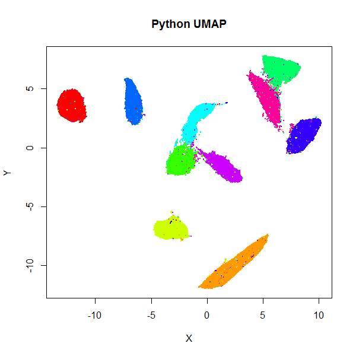
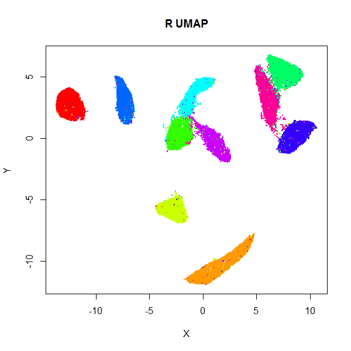

# UWOT

An R implementation of the 
[Uniform Manifold Approximation and Projection (UMAP)](https://arxiv.org/abs/1802.03426) 
method for dimensionality reduction (McInnes and Healy, 2018).

## Installing

```R
install.packages("devtools")
devtools::install_github("jlmelville/uwot")
library(uwot)

# See function man page for help
?umap
```

## Example

```R
iris_umap <- umap(iris, n_neighbors = 50, alpha = 0.5, init = "random")

# Load mnist from somewhere, e.g.
# devtools::install_github("jlmelville/snedata")
# mnist <- snedata::download_mnist()
mnist_umap <- umap(mnist, n_neighbors = 15, min_dist = 0.001, verbose = TRUE)
```

### t-UMAP

If you choose the UMAP curve parameters to be `a = 1` and `b = 1`, you get
back the Cauchy distribution used in 
[t-Distributed Stochastic Neighbor Embedding](https://lvdmaaten.github.io/tsne/) 
and [LargeVis](https://arxiv.org/abs/1602.00370). This also happens to
significantly simplify the gradient leading to a noticeable speed-up (around
50% for MNIST), at the cost of larger, more spread-out clusters than from
the typical UMAP settings (they're still more compact than you see in t-SNE,
however). To try t-UMAP, use the `tumap` function:

```R
mnist_tumap <- tumap(mnist, n_neighbors = 15, verbose = TRUE)
```

Note that using `umap(a = 1, b = 1)` doesn't use the simplified gradient, so
you won't see any speed-up that way.

## Implementation Details

For small (N < 4096), exact nearest neighbors are found using the 
[FNN](https://cran.r-project.org/package=FNN) package. Otherwise, approximate
nearest neighbors are found using 
[RcppAnnoy](https://cran.r-project.org/package=RcppAnnoy).

Coordinate initialization uses
[RSpectra](https://cran.r-project.org/package=RSpectra) to do the
eigendecomposition of the normalized Laplacian.

The smooth k-nearest neighbor distance and stochastic gradient descent
optimization routines are written in C++ (using
[Rcpp](https://cran.r-project.org/package=Rcpp) and 
[RcppArmadillo](https://cran.r-project.org/package=RcppArmadillo)), aping
the Python code as closely as possible. It is my first time using Rcpp, so 
let's assume I did a horrible job (as we shall see when we look at performance
numbers versus Python).

For the datasets I've tried it with, the results look at least
reminiscent of those obtained using the 
[official Python implementation](https://github.com/lmcinnes/umap).
Below are results for the 70,000 MNIST digits (downloaded using the
[snedata](https://github.com/jlmelville/snedata) package). On the left
is the result of using the official Python UMAP implementation 
(via the [reticulate](https://cran.r-project.org/package=reticulate) package).
The right hand image is the result of using `uwot`.

|                                    |                                  |
|------------------------------------|----------------------------------|
|       |       |

## Performance

On my not-particularly-beefy laptop `uwot` took around 4 minutes. 
For comparison, the default settings of the R package for
[Barnes-Hut t-SNE](https://cran.r-project.org/package=Rtsne) took 21 minutes, and the
[largeVis](https://github.com/elbamos/largeVis) package took 56 minutes.

The Python UMAP implementation (powered by the JIT-magic of 
[Numba](https://numba.pydata.org/)) 
took just under 2 minutes (it takes 11 minutes to get through this via
reticulate for reasons I haven't looked into). I've looked at some rough timings
which show that both the nearest neighbor search (40 seconds in Python, 65
seconds in R) and stage optimization (60 seconds in Python, 90 seconds in R)
could do with some improvements. The experimental parallel support in Numba is
on for the nearest neighbor search, but not for the optimization.

I would welcome any suggestions on how to improve this. However, it's certainly
fast enough for my needs.

## Limitations

* Only Euclidean distances are supported for finding nearest neighbors. You can
pass in a `dist` object instead of a data frame. Sparse matrices are not yet 
supported.

## License

[GPLv3 or later](https://www.gnu.org/licenses/gpl-3.0.txt).

## See Also

* The [UMAP](https://github.com/lmcinnes/umap) reference implementation and
[publication](https://arxiv.org/abs/1802.03426).
* Other R packages for UMAP: https://github.com/ropenscilabs/umapr and 
https://github.com/tkonopka/umap
